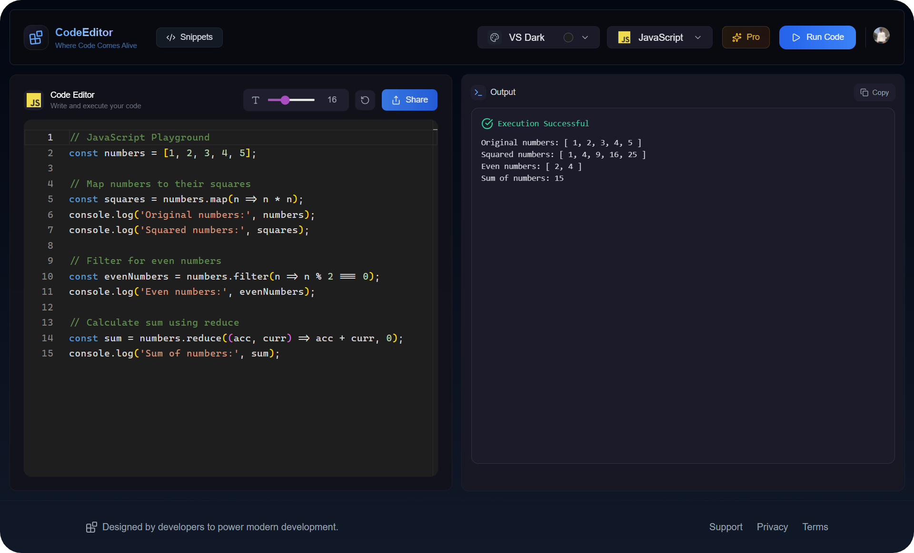

# Code Editor 💻



Welcome to the **Full Stack Code Editor** project!  
This is a modern, high-performance web-based code editor built using a cutting-edge full stack.  
The app focuses on clean UI, smooth animations, scalability, and a great developer experience.

🌐 Live Demo: https://codee-editorr-pro.vercel.app

## 🚀 Features

- **In-Browser Code Editor**
  Write and manage code directly in the browser with a clean, distraction-free interface.

- **TypeScript & JavaScript Support**
  First-class support for modern TypeScript and JavaScript workflows.

- **Smooth Animations**
  Polished micro-interactions powered by Framer Motion.

- **Modern UI**
  Fully responsive design using Tailwind CSS.

- **Backend & Authentication**
  Scalable backend powered by Convex.

- **Payments & Subscriptions**
  Integrated Lemon Squeezy for handling payments.

- **Production-Ready Deployment**
  Deployed on Vercel for fast global performance.

## 🛠️ Technologies Used

- **Next.js** – React framework for full-stack applications
- **TypeScript and Javascript** – Type-safe JavaScript
- **Tailwind CSS** – Utility-first CSS framework
- **Framer Motion** – Animations and transitions
- **Node.js** – Backend runtime
- **Convex** – Backend & real-time database
- **Lemon Squeezy** – Payments & subscriptions
- **Vercel** – Deployment platform

## 🔧 Getting Started

Follow these steps to get the project up and running locally.

### Prerequisites

- Node.js (v18+ recommended)
- npm or pnpm
- Git
- GitHub account

### Installation

1. **Clone the repository**
   ```bash
   git clone https://github.com/utsavpatel562/code-editor.git
   cd code-editor
   ```
   
2. **Install dependencies**
   ```
   npm install
   ```
   
3. **Set up environment variables (Create a .env.local file in the root directory):**
   ```
   NEXT_PUBLIC_CLERK_PUBLISHABLE_KEY = YOUR_KEY_HERE
   CLERK_SECRET_KEY = YOUR_KEY_HERE
   CONVEX_DEPLOYMENT = YOUR_KEY_HERE
   NEXT_PUBLIC_CONVEX_URL = YOUR_KEY_HERE
   CLERK_JWT_ISSUER_DOMAIN = YOUR_KEY_HERE
   CHEKOUT_LEMON_SQUEEZY = YOUR_KEY_HERE
   ```

4. **Run the development server**
   ```
   npm run dev
   ```

### 📜 License
This project is licensed under the MIT License.
See the LICENSE file for details.

Happy coding! 🎉
Feel free to customize this README based on your project’s needs.
